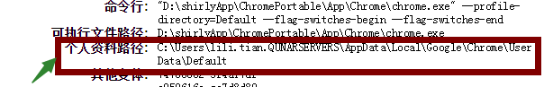
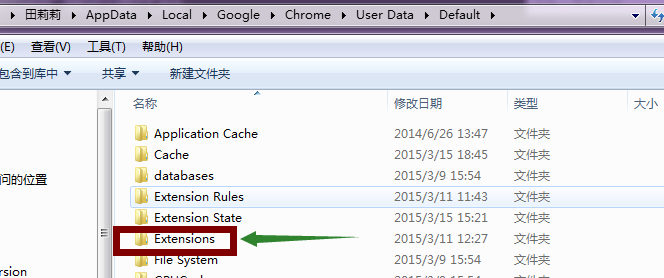
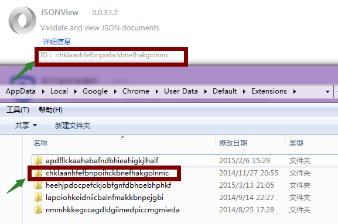
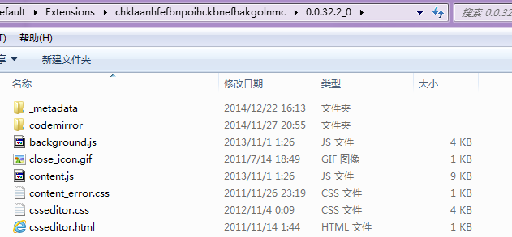

此文是开发avalon的VM tree图形化工具的知识积累，主要用来备忘。关于avalon tree可以[点这里](https://github.com/shirlyLoveU/actree)

## 查看chrome扩展源码的方法

### 已经安装的扩展的源码
1. chrome浏览器地址栏输入chrome://extensions/打开扩展页面 

2. 记录要查看的扩展的ID

3. 地址栏输入chrome://version/找到*个人资料路径*

4. 将上面拷贝的路径输入资源管理器的地址栏，进入Extensions目录

5. 进入目录名是扩展ID 的那个目录

6. 进入版本目录就可以看到源码了

