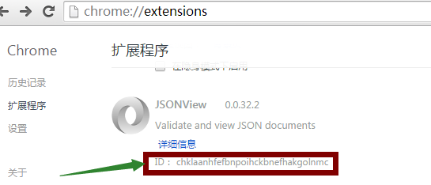

此文是开发avalon的VM tree图形化工具的知识积累，主要用来备忘。关于avalon tree可以[点这里](https://github.com/shirlyLoveU/actree)

先来看看为什么需要浏览器插件？

浏览器插件，可以大大扩展浏览器功能。包括但不仅限于捕捉特定网页的内容，捕捉HTTP报文，捕捉用户浏览动作，改变浏览器地址栏/起始页/书签/Tab等界面元素的行为，与别的站点通信，修改网页内容……给你增加许多想象空间，不过，其也有弊端，首先它会带来一些安全隐患，也可能让你的浏览器变得缓慢甚至不稳定。

## 查看chrome扩展源码的方法

### 已经安装的扩展的源码
#### chrome浏览器地址栏输入chrome://extensions/打开扩展页面 


#### 记录要查看的扩展的ID



#### 地址栏输入chrome://version/找到*个人资料路径*


#### 将上面拷贝的路径输入资源管理器的地址栏，进入Extensions目录


#### 进入目录名是扩展ID 的那个目录


#### 进入版本目录就可以看到源码了


### 查看扩展文件的源码

扩展文件的后缀名通常是.crx，把后缀名改为.zip然后解压缩就可以了

## 开发中扩展的安装

打开chrome扩展程序页面，将自己的扩展程序拖进扩展页面安装


## 扩展程序的调试

### 调试content script
在chrome控制台的source面板中打开Content srcript可以找到我们的content script文件，在这里我们设置断点进行常规调试开发


### 调试background

由于background和content script不在同一个运行环境，所以调试background需要打开插件页，点**检查视图**对应的***背景页***就出现了调试窗口


### 调试popup

虽然Popup和Background是处于同一运行环境中，但在刚才的Background的调试窗口中是看不到Popup的代码的。调试Popup还需要这样：


## 打包扩展程序

扩展程序要发布需要打包成.crx文件,可以通过下图所示的方式打包：


## chrome extension开发知识点

先来看下一个简单的manifest.json文件
```
{
  "manifest_version": 2,

  "name": "One-click Kittens",
  "description": "This extension demonstrates a browser action with kittens.",
  "version": "1.0",

  "permissions": [
    "https://secure.flickr.com/"
  ],
  "browser_action": {
    "default_icon": "icon.png",
    "default_popup": "popup.html"
  }

   "background": { "scripts": ["background.js"] },
    
}
```

1. manifest.json作为插件的配置文件，同时可以看作程序的“入口”，因为它指定了显示什么图标，background script有哪些文件，content script又有哪些文件，pop up的页面是什么

2. popup.html 点击avalon vm tree扩展程序后弹出的图形界面

popup.js是图形界面需要引用执行的js文件

3. 要想扩展程序的js正常执行，必须将js和html分开存放，这是出于安全考虑

4. manifest_version: 应该总是2

4. permissions: 允许插件做哪些事情，访问哪些站点，假如一个插件的"permissions"里写有“http://*.hacker.com/”，那么这个插件就被允许访hacker.com上的所有内容，包括可能会把你的一些个人信息提交给hacker.com，危险性不言而喻，查看一个插件能访问哪些站点的方法是：在chrome的地址栏里输入“chrome://extensions/”，然后点对应插件的旁边的那个“权限”


6."default_popup"：用来指定点击小图标后弹出的小窗口中默认显示的是哪个html，这个弹出的小窗口就叫做“popup”。

"browser_action"：这是一个浏览器级的动作，也就是说，不管你现在在访问哪个页面，那个小按钮总是显示出来，而我们的插件如果仅仅是针对某些页面的话，就不适合用这个"browser_action"了。下面我们来弄一个只有访问博客园（www.cnblogs.com）才会出现的小按钮。

```
"permissions": ["tabs"],
    "page_action": {
      "default_icon": {
           "19": "cnblogs_19.png",
           "38": "cnblogs_38.png"
      },
      "default_title": "cnblogs.com article information"
    }
```


“permissions”属性里的“tabs”是必须的，否则下面的js不能获取到tab里的url，而这个url是我们判断是否要把小图标show出来的依据

background是什么概念？这是一个很重要的东西，可以把它认为是chrome插件的主程序，理解这个很关键，一旦插件被启用（有些插件对所有页面都启用，有些则只对某些页面启用），chrome就给插件开辟了一个独立的javascript运行环境（又称作运行上下文），用来跑你指定的background script，在这个例子中，也就是background.js。


content script就是我们要注入到页面中的脚本，插件允许我们往网页中注入脚本，这是一个多么让人有想象力的功能，其功能之强大无需多解释，总的来说，就是让我们全面干预页面的内容！也许你马上会想到，这可能带来很大的安全隐患，没错，有些恶意插件会窃取你的页面信息，而有些有漏洞的插件则可能让你遭受跨站脚本注入（XSS）的攻击；另一个可能你会想到的问题是：往页面中注入自己的脚本，难道不会跟页面原本的脚本发生冲突吗？能想到这点说明你真的很厉害，如果我们的注入脚本和页面原本的脚本处于同一个运行环境中，确实会发生冲突，所以，Chrome是另外开辟了一个独立的运行空间，供我们的Content Script使用的，Content Script能访问DOM的内容，但却不能访问页面原本的脚本（我是说直接访问不行），反之，页面原本的脚本也不能直接访问Content Script。在图中，浅红色的背景块代表Content Script的运行环境，而浅蓝色的背景块代表页面运行环境，另外插件的运行环境我用浅绿色表示，注意，这是三个不同的运行环境，调试的时候你会充分体会到它们的不同。

那么，Content Script会在什么时候运行呢？默认情况下，是在网页加载完了和页面脚本执行完了，页面转入空闲的情况下（Document Idle），但这个是可以改变的，详情可参考https://developer.chrome.com/extensions/content_scripts.html，查看其中的“run_at”。

由于处于不同的运行环境中，Content Script和Background Script不能直接互相访问，那它们之间如何通信？通过Message！

Page Actions与Browser Actions的区别就是Page Actions不是随时都是显示的，必须在特定的页面中这个功能才能使用。因此在开发中注意：如果不是全部页面中都能使用的功能请使用Page Actions方式。


## 学习资源

比如搜索高亮的word highlight扩展，tab 管理图形化工具GraphicsTab等

[chrome 插件(extensions)开发攻略](http://www.cnblogs.com/guogangj/p/3235703.html)

[官方学习指导](https://developer.chrome.com/extensions/getstarted.html)

[手把手教你开发chrome扩展一：开发Chrome Extenstion其实很简单](http://www.cnblogs.com/walkingp/archive/2011/03/31/2001628.html)

[官方extension实例](https://developer.chrome.com/extensions/samples)

[extension 打包发布](https://crxdoc-zh.appspot.com/apps/packaging)