### $$(selector) [equivalent to document.querySelectorAll()]
Returns an array of elements that match the given CSS selector

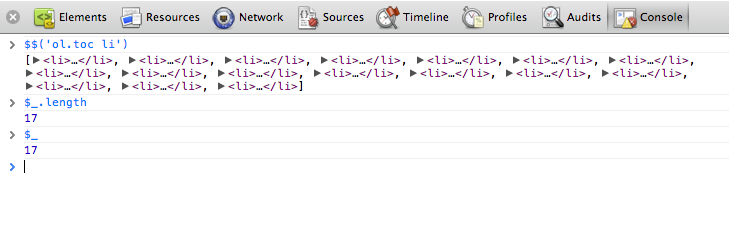

### $x(path)
Returns an array of DOM elements that match the given XPath expression. For example, the following returns all the <p> elements that contain <a> elements

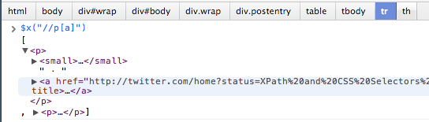

### keys
获取传入对象所有属性名组成的数据

### values
获取传入对象所有属性值组成的数组

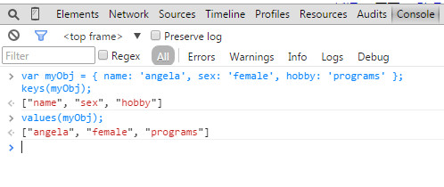

### profile
Starts a JavaScript CPU profiling session with an optional name. To complete the profile call profileEnd().

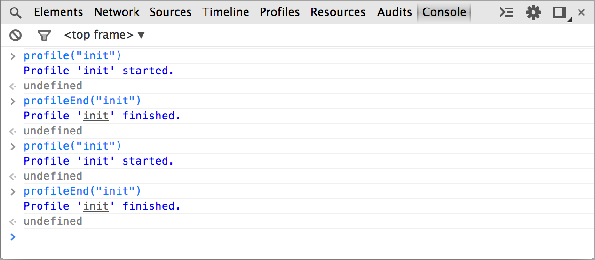

the result in the profiles panel:

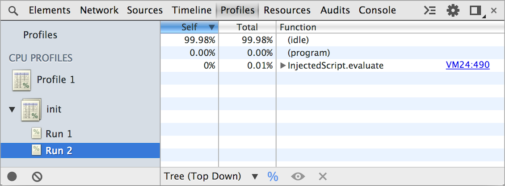

### monitorEvents(object[, events])
When one of the specified events occurs on the specified object, the Event object is logged to the console. You can specify a single event to monitor, an array of events, or one of the generic events "types" that are mapped to a predefined collection of events.

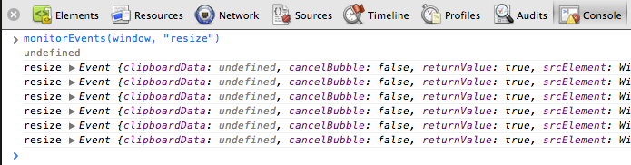

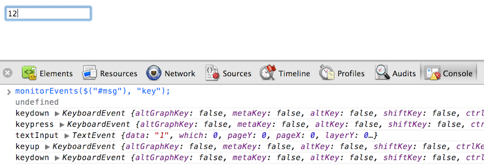

use unmonitorEvents to stop the monitoring events

### inspect(object/function)
Opens and selects the specified element or object in the appropriate panel: either the Elements panel for DOM elements and the Profiles panel for JavaScript heap objects.

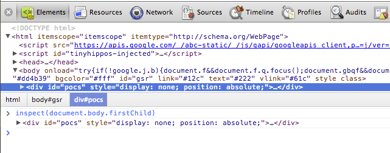

When passing a function to inspect, when the function is called it will open it up in the Sources panel for you to inspect.

### copy
通过此命令可以将在控制台获取到的内容复制到剪贴板

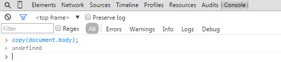

### getEventListeners(object)
Returns the event listeners registered on the specified object

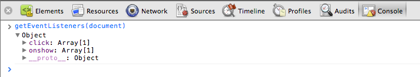

### debug(function)
When the function specified is called, the debugger will be invoked and will break inside the function on the Sources panel allowing you to be able to step through the code and debug it.

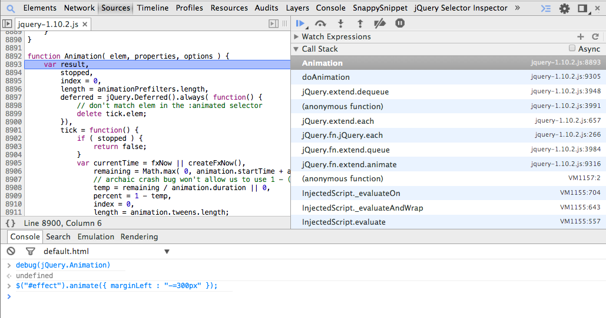

Use undebug(fn) to stop breaking on the function, or use the UI to disable all breakpoints.

### monitor & unmonitor

monitor(function)，它接收一个函数名作为参数，比如function a,每次a被执行了，都会在控制台输出一条信息，里面包含了函数的名称a及执行时所传入的参数。

而unmonitor(function)便是用来停止这一监听。

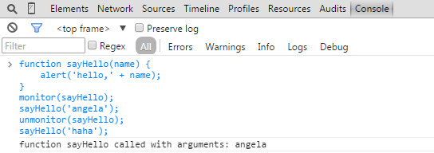

### $0-$4 ($0 $1 $2 $3 $4)

代表了最近5个你选择过的DOM节点

### $_

返回最近一次表达式执行的结果，功能跟按向上的方向键再回车是一样的

### $(selector) [alias for document.querySelector() function]

Returns reference to the first DOM element with the specified CSS selector

### table(data[, columns])
Log object data with table by passing in a data object in with optional column headings.

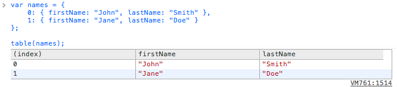

### console.info
输出提示性信息

### console.error
输出错误信息

### console.warn
输出警示信息

### console.debug
输出调试信息

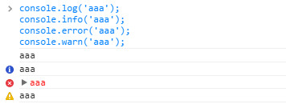

console对象的上面5种方法，都可以使用printf风格的占位符。不过，占位符的种类比较少，只支持字符（%s）、整数（%d或%i）、浮点数（%f）、DOM对象（%o）、js对象（%O）、样式（%c）

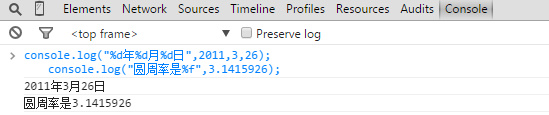

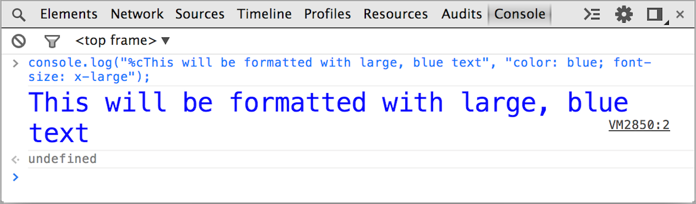

### console.dirxml
显示网页的某个节点所包含的html/xml代码

### console.group
输出一组信息的开头

### console.groupEnd
结束一组输出信息

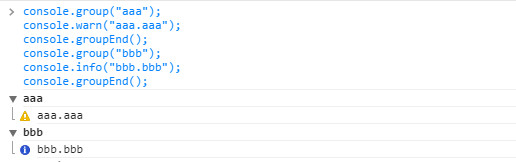

### console.assert, 对输入的表达式进行断言，只有表达式为false时，才输出相应的信息到控制台

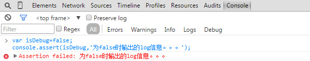

### console.count, 统计代码被执行的次数

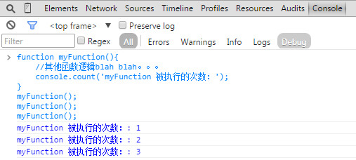

### console.dir, 将dom树的节点以DOM树的结构进行输出，可以详细查看对象的方法，可代替for in

### console.time, 计时开始

### console.timeEnd, 计时结束

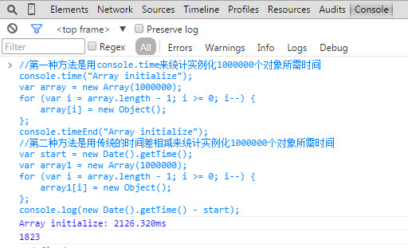

### console.profile与console.profileEnd配合使用查看CPU使用相关信息

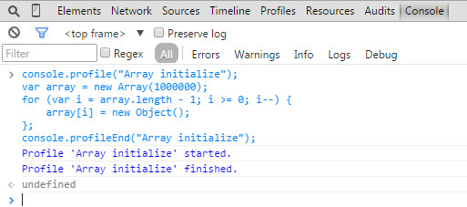

在profiles面板里面查看就可以看到cpu相关使用信息

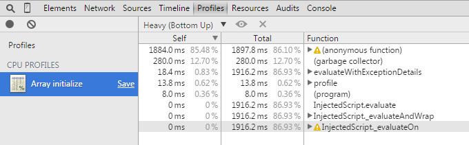

### console.timeLine和console.timeLineEnd配合使用一起记录一段时间轴

### console.trace, 堆栈跟踪相关调试

### console.table

On Chrome you can pretty-print an associative array to the console using console.table(arr)

```js
    var teams_data = [{team: 'Chelsea', goals: 4}, {team: 'Man. Utd', goals: 3}];
    console.table(teams_data);
```

