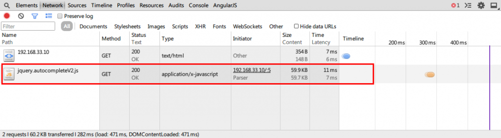
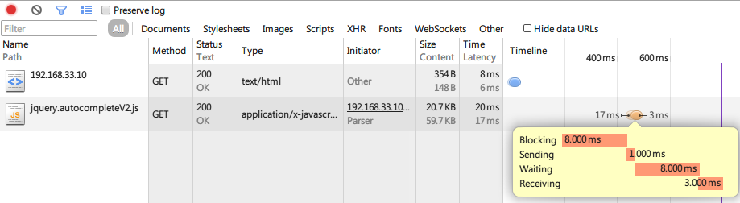

来看个chrome dev tools下的网络请求概览：

网络概览列表的Size Content栏，上边的数值Size表示响应大小，Size大小 = Content大小 + 响应头大小， Content表示响应内容实际大小，比如浏览器请求了一个实际尺寸为61093字节的文件，那么这里Content的值便为61093byte ÷ 1024 ≈ 59.7KB，Size值不一定大于Content的值，当我们在开启Gzip压缩的情况下Size的大小很可能小于Content的大小，开启Gzip后，尽管服务器没有直接告诉我们响应内容的Content-Length大小，但是浏览器拿到压缩后的响应内容是可以间接的反向计算出响应内容的原始大小的，还有一种情况是Content使用的是本地缓存，也就是服务器返回304状态码告诉浏览器继续使用缓存中的内容，Size的大小只是响应头的大小，Content大小为从缓存中读取的响应内容的大小。 当我们的光标移动到HTTP请求的timeline上时会显示网络请求时间花费的详细信息，如图：

这里涉及到几个名词，下面解释下Chrome NetWork Timeline状态名词的意义：

* Blocking代表了等待当前已存在连接可用状态所花费的时间，相当于我们将请求A放入浏览器请求队列里面，浏览器依次处理队列里面的请求直到开始处理请求A所花费的等待时间。
* Proxy代表了连接代理服务器所花费的时间。
* DNSLookup代表了DNS查找花费的时间。
* Connecting代表了创建连接所花费的时间，包括TCP连接建立、DNS查找、连接代理服务器与创建安全连接（SSL）所花费的时间总和。
* Sending代表了发送请求数据所花费的时间。
* Waiting代表了等待服务器响应所花费的时间。
* Receiving代表了接收服务器响应内容花费的时间。
* Time Latency一栏Time代表了从我们创建请求到浏览器接收到服务器响应内容这个过程所花费的时间，Latency代表了从我们创建请求到服务器生成响应内容这段时间花费的时间。
